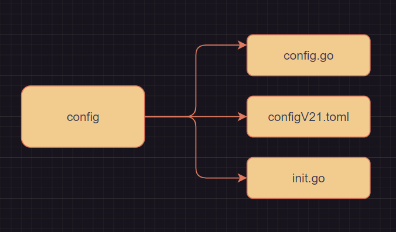

## config模块



### configV21.toml

这个是一个配置文件，类似于Java里面的yml，用于配置数据库等一些环境变量

```
[mysql]  #这个代表一个类
# address = "50.18.79.42" 这是注释
address = "localhost"
port = "3306"
db_name = "pledge_v21"
user_name = "root"
password = "root"
max_open_conns = 0
max_idle_conns = 0
max_life_time = 0
```


### init.go

### config.go